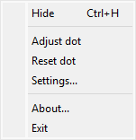
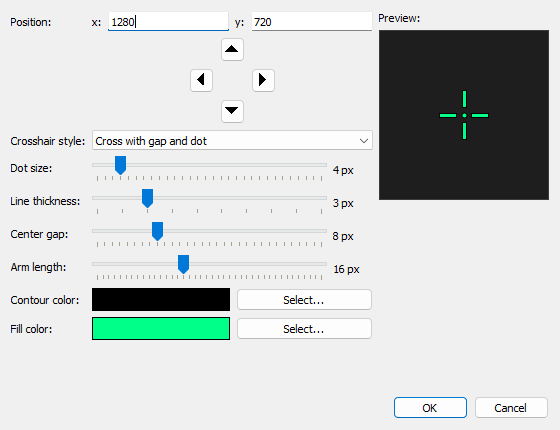
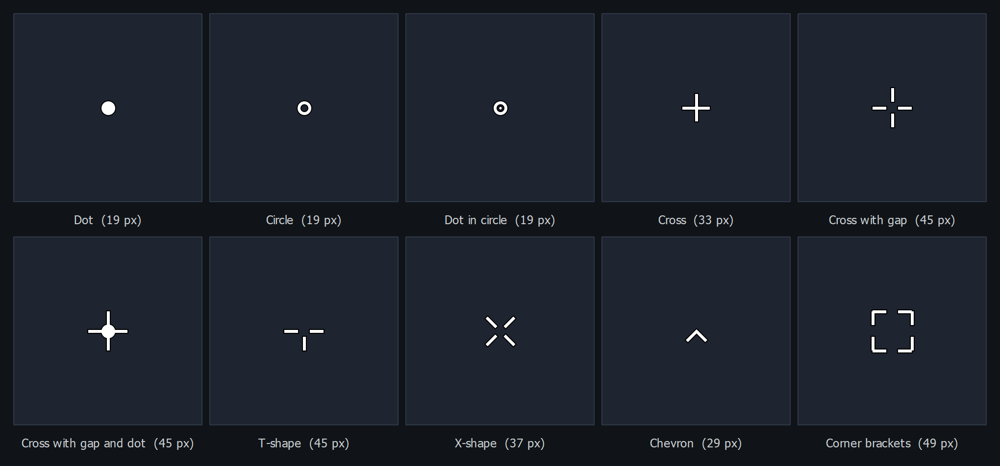

# Center Dot

Center Dot is a Windows application that renders a crosshair in the center of the screen. It is useful for PC games that do not provide a crosshair. Ten [styles](#crosshair-styles) are available, from the plain dot the program is named after to gapped crosses and corner brackets, in the size and colors of your choosing.

Note that this only works, when using the "borderless window" mode of games, as CenterDot is only a "Windows window" that places itself over the game window and stays on top. Adding a crosshair to a game in fullscreen mode would require more DirectX hacking and may be suspicous to anti-cheat engines.


## Usage

Start CenterDot.exe.
A little crosshair should appear on the screen.
The crosshair should stay visible in games using borderless window mode.

When the program is running it does not appear in the task bar but is accessible as a notification icon via the systray (notification bar):


From there you can access a context menu using right click on the icon:



The dot can be shown/hidden using the menu entry. 
There is also a shortcut/hotkey to show/hide the crosshair in-game: <kbd>Ctrl</kbd> + <kbd>H</kbd>

Using the option "Adjust dot" you can move the crosshair/dot to another position using the arrow keys on your keyboard. When done, click the menu entry "Adjust dot" again to disable the adjustment mode.

Using the option "Reset dot" the dot is re-aligned to the center of your primary screen and all of its settings go back to their defaults.

The context menu entry "Exit" quits the application and removes the crosshair.

## Crosshair styles

The context menu entry "Settings..." opens a dialog where the shape of the crosshair is picked. A preview next to the controls shows what the choice looks like before it is applied, and the measurements the selected style does not use are greyed out.



These are the available styles, all drawn at the same size, thickness, gap and arm length so they can be compared. The number below each one is the size of the window the overlay needs for it:



| Style | Description |
| --- | --- |
| Dot | A filled dot, the original Center Dot look and the default. |
| Circle | A hollow ring. |
| Dot in circle | A ring with a small dot in its middle. |
| Cross | Four arms meeting in the middle, a plain plus sign. |
| Cross with gap | Four arms with the middle left open, the classic shooter crosshair. |
| Cross with gap and dot | The same, plus a dot on the aiming point. |
| T-shape | Left, right and lower arm only, keeps the view above the aiming point clear. |
| X-shape | Four diagonal arms with the middle left open. |
| Chevron | An arrow head with its tip on the aiming point. |
| Corner brackets | Four corner brackets framing the aiming point. |

Every style is drawn in a fill color with a contour around it, both of which are free to choose, transparency included. Setting the contour color to fully transparent leaves the crosshair without an outline.

Four measurements shape the crosshair. Only the ones the selected style actually uses stay enabled in the dialog:

| Setting | Range | Used for |
| --- | --- | --- |
| Dot size | 1-30 px | Diameter of the dot resp. of the surrounding circle. |
| Line thickness | 1-10 px | Stroke width of the lines a crosshair is built from. |
| Center gap | 0-30 px | Distance between the aiming point and where the lines start. |
| Arm length | 1-40 px | Length of a single line of the crosshair. |

Settings are stored in `centerdot.ini` below your Windows application data directory and are written when the program exits.

## Building from source

You need Qt 5 (built against 5.15.2), CMake 3.13 or newer, and a compiler. The releases are built with the MSVC 2022 build tools and Ninja.

`CMakeLists.txt` falls back to a hardcoded Qt location that almost certainly is not yours, so point `CMAKE_PREFIX_PATH` at your own Qt installation instead of editing the file:

```
cmake -S . -B build/release -G Ninja -DCMAKE_BUILD_TYPE=Release -DCMAKE_PREFIX_PATH=C:/Qt/5.15.2/msvc2019_64
cmake --build build/release
```

Run this from a developer command prompt, so that the compiler and Ninja are on the `PATH`. With MinGW instead of MSVC, point `CMAKE_PREFIX_PATH` at the matching Qt kit (for example `C:/Qt/5.15.2/mingw81_64`). There is also a `CenterDot.pro` for building with qmake resp. from Qt Creator.

The version number the About box shows comes from `src/version_number.h`. CMake generates that file from `CMakeLists.txt` at configure time; qmake does not, so a qmake build uses the copy that is checked in. Keep the `VERSION` in `CenterDot.pro` in step when you change it.

### Packaging a build

`CenterDot.exe` needs the Qt libraries and the Visual C++ runtime next to it to run on a machine that has neither installed:

```
windeployqt --release --no-translations --no-system-d3d-compiler --no-opengl-sw <folder>\CenterDot.exe
```

Note that `windeployqt` only copies the Visual C++ runtime when it can find your Visual Studio installation, which it does through `VCINSTALLDIR`. If that variable is not set it silently skips those DLLs and the result runs on your machine but not on one without the redistributable. Copy `msvcp140*.dll` and `vcruntime140*.dll` from the `VC/Redist` folder of your Visual Studio installation yourself if that happens.
